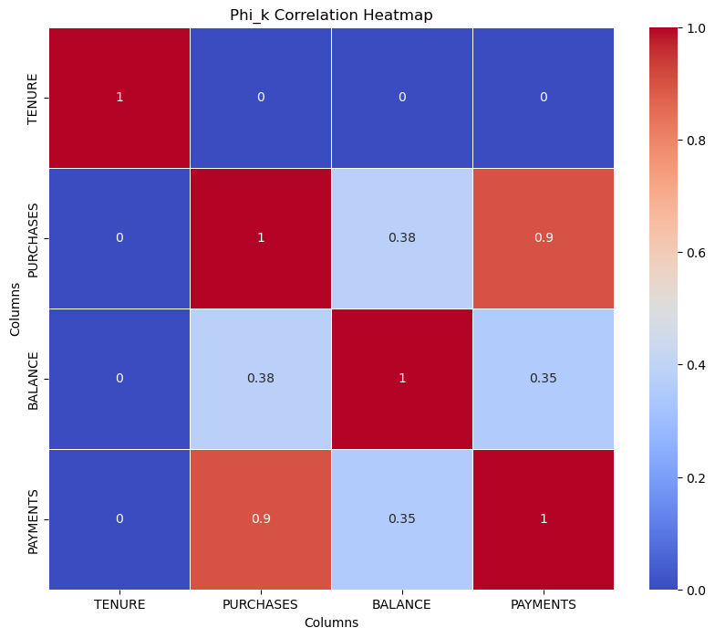
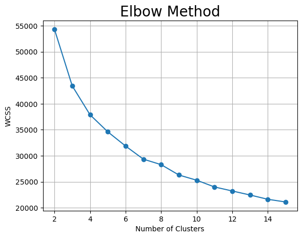
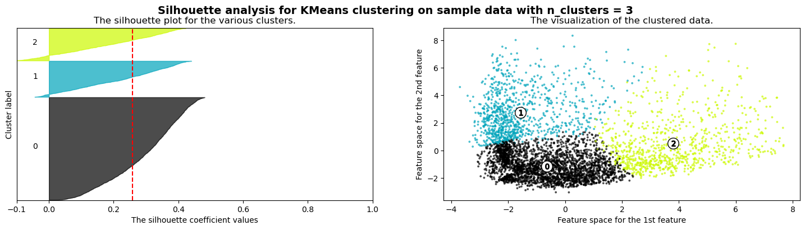
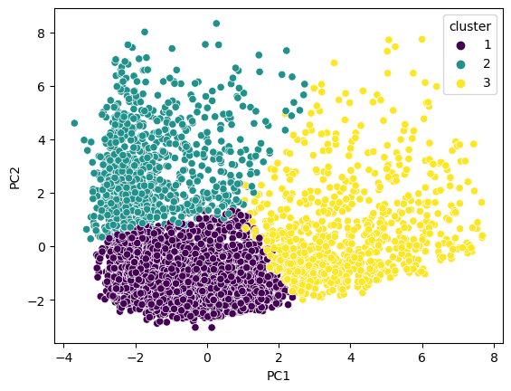

# Credit Card User Segmentation 💳📊


## 📌 Table of Contents
- [Overview](#overview)
- [Dataset](#dataset)
- [Installation](#installation)
- [Usage](#usage)
- [Data Preprocessing](#data-preprocessing)
- [Exploratory Data Analysis (EDA)](#exploratory-data-analysis-eda)
- [Feature Selection](#feature-selection)
- [Dimensionality Reduction](#dimensionality-reduction)
- [Clustering](#clustering)
- [Model Evaluation](#model-evaluation)
- [Results](#results)

## 🔍 Overview

This project focuses on segmenting credit card users based on their spending behaviors and credit card usage patterns. By applying advanced data analysis and machine learning techniques, the aim is to provide valuable insights for targeted marketing strategies and personalized financial services.

## 📊 Dataset

The dataset was loaded from Google Cloud Platform using BIGQUERY with the following SQL query:
```sql
SELECT *
FROM
    `project-table.credit-card-information`
WHERE (MOD(CUST_ID,2) != 0)
ORDER BY CUST_ID;
```

The dataset used in this project contains information about credit card users. Here's a breakdown of the columns:

| Column Name                      | Data Type | Description                                                                                             |
|----------------------------------|-----------|---------------------------------------------------------------------------------------------------------|
| CUST_ID                          | INT64     | Identification of Credit Card holder                                                                    |
| BALANCE                          | FLOAT64   | Balance amount left in their account to make purchases                                                  |
| BALANCE_FREQUENCY                | FLOAT64   | How frequently the Balance is updated, score between 0 and 1 (1 = frequently updated, 0 = not frequently updated) |
| PURCHASES                        | FLOAT64   | Amount of purchases made from account                                                                   |
| ONEOFF_PURCHASES                 | FLOAT64   | Maximum purchase amount done in one-go                                                                  |
| INSTALLMENTS_PURCHASES           | FLOAT64   | Amount of purchase done in installment                                                                  |
| CASH_ADVANCE                     | FLOAT64   | Cash in advance given by the user                                                                       |
| PURCHASES_FREQUENCY              | FLOAT64   | How frequently the Purchases are being made, score between 0 and 1 (1 = frequently purchased, 0 = not frequently purchased) |
| ONEOFF_PURCHASES_FREQUENCY       | FLOAT64   | How frequently purchases are happening in one-go (1 = frequently purchased, 0 = not frequently purchased) |
| PURCHASES_INSTALLMENTS_FREQUENCY | FLOAT64   | How frequently purchases in installments are being done (1 = frequently done, 0 = not frequently done)  |
| CASH_ADVANCE_FREQUENCY           | FLOAT64   | How frequently the cash in advance being paid                                                           |
| CASH_ADVANCE_TRX                 | INT64     | Number of Transactions made with 'Cash in Advance'                                                      |
| PURCHASES_TRX                    | INT64     | Number of purchase transactions made                                                                    |
| CREDIT_LIMIT                     | FLOAT64   | Limit of Credit Card for user                                                                           |
| PAYMENTS                         | FLOAT64   | Amount of Payment done by user                                                                          |
| MINIMUM_PAYMENTS                 | FLOAT64   | Minimum amount of payments made by user                                                                 |
| PRC_FULL_PAYMENT                 | FLOAT64   | Percent of full payment paid by user                                                                    |
| TENURE                           | INT64     | Tenure of credit card service for user                                                                  |

## 🛠️ Installation

1. Clone the repository:
   ```
   git clone https://github.com/yourusername/credit-card-user-segmentation.git
   ```
2. Navigate to the project directory:
   ```
   cd credit-card-user-segmentation
   ```
3. Install required packages:
   ```
   pip install -r requirements.txt
   ```

## 🚀 Usage

1. Run the main notebook:
   ```
   python credit-card-user-segmentation.ipynb
   ```
2. View the results in the `output` code cells.

## 🧹 Data Preprocessing

- Handled missing values
- Removed outliers using the Interquartile Range (IQR) method
- Normalized the data using log transformation

## 📊 Exploratory Data Analysis (EDA)

- Analyzed the distribution of each feature
- Identified correlations between features
- Visualized key insights using heatmaps and box plots



## 🎯 Feature Selection

- Used correlation analysis to identify highly correlated features
- Selected relevant features for clustering

## 📉 Dimensionality Reduction

- Applied Principal Component Analysis (PCA) to reduce the dimensionality of the dataset
- Determined the optimal number of components to retain

## 🧮 Clustering

- Used the Elbow method and Silhouette analysis to determine the optimal number of clusters
- Applied K-means clustering algorithm with k=3
- Initialized centroids using k-means++ method



## 📏 Model Evaluation

- Evaluated the clustering results using silhouette score
- Visualized the clusters using box plots for each feature



## 📈 Results

The analysis revealed three distinct user segments:

1. Lower-income or conservative credit users
2. Moderate balance users with high cash advance frequency
3. High-income, high-spending users

These insights can be leveraged for targeted marketing campaigns and product development.



---

For more details, please refer to the [credit-card-user-segmentation.ipynb](credit-card-user-segmentation.ipynb) notebook.
